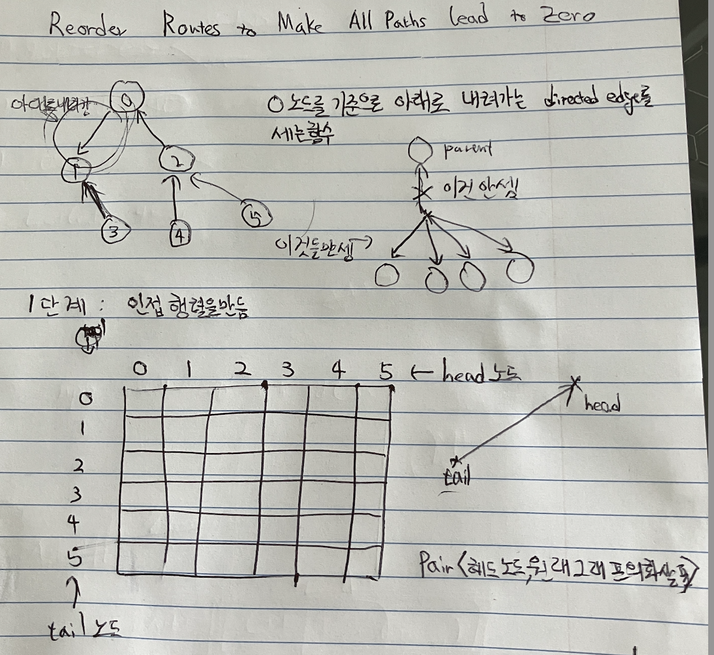

# 1466. Reorder Routes to Make All Paths Lead to the City Zero
## 문제 설명
- 이 문제는 0 노드에서 시작해서 화살표가 바깥쪽을 가리키는 (Leaf쪽을 가리키는) 화살표의 개수를 세는 문제입니다.

## 스케치


## 코드
```cpp
class Solution
{
public:
    int count = 0;

    // API: 트리를 순회하면서 count를 갱신하는 함수입니다.
    // 값을 반환하거나 하지는 않고 count만 바꾸는 함수입니다.
    void dfs(int root_node, int parent_node,
             vector<vector<pair<int, bool>>>& adj)
    {
        for (pair<int, bool>& edge : adj[root_node])
        {
            // 화살표가 부모 노드를 가리키고 있지 않다면, 바깥을 향하는 화살표 입니다.
            // 바깥을 향하는 화살표만 고르므로, Leaf 노드에 대한 처리를 할 필요가 없습니다.
            if (edge.first != parent_node)
            {
if(edge.second==true){

                // 만약에 바깥을 향하는 화살표라면 count를 추가합니다.
                count += 1;
}
                int head_node = edge.first;
                // 화살표를 기준으로 각 head노드에서 dfs 함수를 실행합니다.
                dfs(head_node, root_node, adj);
            }
        }
    }

    int minReorder(int n, vector<vector<int>>& connections)
    {
        // 인접 행렬: 그래프의 구조를 계산하기 쉽게 2D 매트릭스로 만든것
        vector<vector<pair<int, bool>>> adjacency_matrix;

        // 인접 행렬을 만듭니다.
        for (vector<int>& directed_edge : connections)
        {
            adjacency_matrix[directed_edge[0]].push_back(
                make_pair(directed_edge[1], true));
            adjacency_matrix[directed_edge[1]].push_back(
                make_pair(directed_edge[0], false));
        }
        // 현재 노드를 0으로 설정하고, 0의 parent노드를 존재 하지 않는 -1로 설정
        dfs(0, -1, adjacency_matrix);
        return count;
    }
};
```

## 해설
- 먼저, 그래프 구조를 가지고 인접 행렬을 만듭니다.
  - 인접 행렬에서 각 cell의 값은 <head노드(화살표 끝), 이미 그래프에 존재했던 화살표인가?(boolean)> 입니다.
  - 인접 행렬의 구조를 유지하기 위해, 모든 cell에 값을 채워 넣어야 합니다. 그래서 `이미 존재했는 화살표인가?`가 false이면, 구조 유지를 위한 값입니다.
- 0번째 노드에서 dfs를 실행 시킵니다.
  - dfs로 순회를 하면서, 다음 조건이 충족되면 count를 증가 시킵니다.
    1) 바깥쪽을 향하는 화살표인가?
    2) 이미 그래프에 존재했던 화살표인가?

## 복잡도
시간 복잡도: 인접 행렬을 만들기 위한 O(node 개수)
공간 복잡도: 인접 행렬을 저장 하기위한 O(node개수^2)
