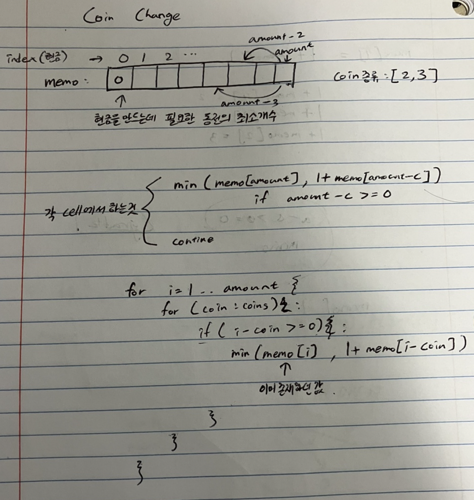

# 322. Coin Change

## 문제 설명
- 이 문제는 최종 목표 금액은 동전들로 만드는데, 동전들을 최소한으로 사용하려면 동전을 몇개를 사용해야 하는지를 구하는 문제입니다.

## 스케치


## 코드

```java
public int coinChange(int[] coins, int amount) {

    int[] memoization = new int[amount + 1];
    Arrays.fill(memoization, amount + 1);
    memoization[0] = 0;

    for (int i = 1; i <= amount; i++) {
        for (int c : coins) {
            if (i - c >= 0) {
                memoization[i] = Math.min(memoization[i], 1 + memoization[i - c]);
            }
        }
    }
    if (memoization[amount] > amount) {
        return -1;
    } else {
        return memoization[amount];
    }
}
```

## 해설
- 이 문제는 memoization을 사용하는 bottom-up 1D dynamic programming을 사용하는 문제입니다.
- array를 목표금액+1의 크기만큼 만들고 0원을 만들기 위한 동전의 최소 개수를 0으로 초기화 합니다. (memoizaion[0] = 0)
- 이 array에서 index는 목표금액을 의미하고, element는 해당 목표금액을 만들기 위해 필요한 최소 동전 개수를 의미합니다.
- 해당 cell의 값을 고려할때, 목표금액에서 동전만큼 뺀 금액을 만드는데 필요한 최소한의 동전 개수는 (목표금액-동전) index를 보고 알아냅니다.
- 그렇게 목표금액에서 동전의 종류만큼 각각 빼보고 최소한 필요한 동전개수가 가장 적은 것을 고릅니다.
- 만약에 목표금액을 만드는데 매개변수로 주어진 coin들로 만들수 없는 금액이면 -1을 반환합니다.

## 복잡도
- 시간 복잡도: O(목표금액*동전종류). 각 cell에서 동전만큼 뺀 금액을 모두 확인함
- 공간 복잡도: O(목표금액). memoization 배열 때문.
