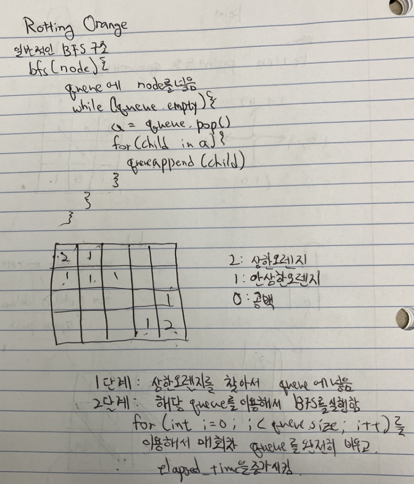

# 994. Rotting Oranges

## 문제 설명
- 이 문제는 상한 오렌지 (값이 2인 cell)을 기준으로 안 상한 오렌지 (값이 1인 cell)을 BFS로 상한 오렌지로 바꾸면서, 각 layer의 회수에서 소요되는 시간을 증가 시키는 문제입니다.
- 매 초마다 기존의 상한 오렌지를 기준으로 상하좌우 cell의 안 상한 오렌지를 상한 오렌지로 바꿉니다.

## 스케치


## 코드
```cpp
int orangesRotting(vector<vector<int>>& grid)
{
    queue<pair<int, int>> current_rotten_oranges;
    int row_count = grid.size();
    int column_count = grid[0].size();
    int remaining_orange = 0;
    int elapsed_time = 0;
    vector<vector<int>> directions = {{-1, 0}, {0, 1}, {1, 0}, {0, -1}};

    // grid의 모든 cell들을 돌면서, 오렌지들을 탐색하여,
    // 1) 상한 오렌지는 상한 오렌지 큐에 넣습니다.
    // 2) 안 상한 오렌지는 remaining_orange값에 추가 시킵니다.
    for (int i = 0; i < row_count; i++)
    {
        for (int j = 0; j < column_count; j++)
        {
            if (grid[i][j] == 2) // 상한 오렌지인 경우
            {
                current_rotten_oranges.push(make_pair(i, j));
            }
            else if (grid[i][j] == 1) // 안 상한 오렌지인 경우
            {
                remaining_orange += 1;
            }
        }
    }

    // BFS의 구조입니다.
    while (!current_rotten_oranges.empty())
    {
        bool rotted_in_current_layer = false;
        int orange_in_queue = current_rotten_oranges.size();

        // 매 회차 큐에 들어있는 상한 오렌지들을 완전히 비웁니다.
        for (int i = 0; i < orange_in_queue; i++)
        {
            pair<int, int> selected_node = current_rotten_oranges.front();
            current_rotten_oranges.pop();

            // 선택된 상한 오렌지 옆에 있는 안 상한 오렌지들을 상하게 만든 후 큐에 넣습니다.
            for (vector<int> d : directions)
            {
                int y = d[0];
                int x = d[1];

                int new_y = selected_node.first + y;
                int new_x = selected_node.second + x;

                // 상한 오렌지 주변을 탐색 할때, grid의 범위를 넘어 서거나 싱싱한 오렌지가 아니면 상하게 만들지 않고 iteration을 넘깁니다.
                if (0 <= new_y and new_y < row_count and new_x >= 0 and new_x < column_count and grid[new_y][new_x] ==
                    1)
                {
                    grid[new_y][new_x] = 2;
                    current_rotten_oranges.push({new_y, new_x});
                    remaining_orange -= 1;
                    rotted_in_current_layer = true;
                }
            }
        }
        // 큐를 완전히 비웠다면 소요시간을 1 증가 시킵니다.
        if (rotted_in_current_layer)
        {
            elapsed_time++;
        }
    }
    // 만약에 bfs를 실행하고도 싱싱한 오렌지가 남았다면,
    // -1을 반환합니다.
    if (remaining_orange > 0)
    {
        return -1;
    }
    else
    {
        return elapsed_time;
    }
}
```

## 해설
1) 먼저 input grid의 각 cell을 돌면서 오렌지들을 체크합니다.
  1) 만약에 오렌지가 상한 오렌지인 경우, 상한 오렌지 queue에 추가 시킵니다.
  2) 만약에 오렌지가 싱싱한 오렌지인 경우, 싱싱한 오렌지의 개수를 증가 시킵니다.
2) 1에서 만들어진 queue를 기준으로 BFS를 실행 시킵니다.
  1) BFS를 실행시키면서, 상하좌우 주변의 싱싱한 오렌지들을 상하게 만들고 queue에 추가 시킵니다.
  2) 이번 회차 (기존 queue에 오렌지의 개수)가 끝났으면, 소요 시간을 1 증가 시킵니다.

## 복잡도
- 시간 복잡도: O(그리드의 cell 개수)
- 공간 복잡도: O(그리드의 cell 개수)
